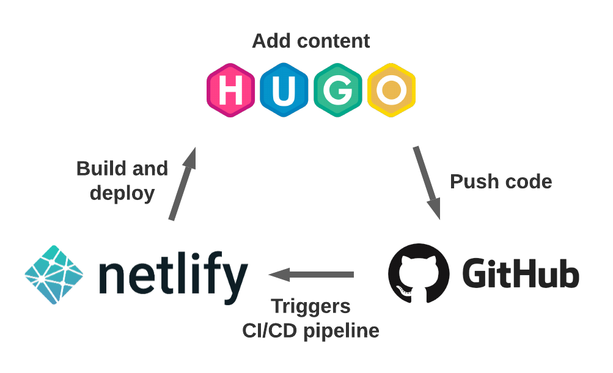

## Problem

My wife and I have always wanted to work on an online project together. She is creative and I can figure out technology. A multitude of reasons pushed us to start a blog in early 2021. 

- My hunger for a software-dev-related side project
- A desire to [digitalize](https://news.sap.com/2016/05/digitization-vs-digitalization-wordplay-or-world-view/) our growing three-ring recipe binder
- Repeated requests for the same recipes (mostly [Thai Red Curry](https://www.jamilghar.com/recipe/thai_red_curry/) and [Butter Chicken](https://www.jamilghar.com/recipe/butter_chicken/)) from friends and family

We thought through the process of me setting up the blog, my wife adding posts and pictures, monetization, etc. and the requirements started to get clearer.

- Intuitive and easy [CRUD](https://developer.mozilla.org/en-US/docs/Glossary/CRUD)-ing of recipes 
- Low reliance on third-party plugins
- A fast, secure and dependable web framework
- Rapid automated deployments
- Intuitive and quick initial set up
- Decently-sized, engaged developer community

## Choices

I did some research and considered the pros and cons of using different blogging stacks with my wife. These are just some of the many good choices out there and fantastic blogs are using each one of them. We ended up choosing the most **fun** and **appropriate** solution for us. 

### CMS ([WordPress](https://wordpress.com/), [Drupal](https://www.drupal.org/), [Joomla](https://www.joomla.org/), ...)
Content management systems have been dominant players in the web dev space for a long time. Between taking [Jenn Kramer](https://www.extension.harvard.edu/faculty-directory/jennifer-kramer)'s CMS courses and troubleshooting a WordPress site for my dad's work, I am comfortable with the technology. Reliance on closed-source third-party plugins, use of PHP, security vulnerabilities and website size turned me off from this option. 

### [Django](https://www.djangoproject.com/)/[Wagtail](https://wagtail.io/)
I have been enamored with all things Django for a few years. I follow the maintainers on Twitter, listen to the official podcast and watch conference talks on YouTube. I could have developed and managed a blog using it but I felt like the learning curve would drive my wife away. At the time, we just wanted to throw some images and text on a page for people to see.     

### SaaS ([Wix](https://www.wix.com/), [Squarespace](https://www.squarespace.com/))
I usually recommend these solutions to friends that want a website but do not want to develop with code. These would be costlier and wouldn't scratch my development itch.

### [Jamstack](https://jamstack.org/)
This newer paradigm is getting popular for producing simple, fast and secure static sites. The downside is not being able to add features like authentication, comments, search, etc. 

## Solution   

### [Hugo](https://gohugo.io/), [Github](https://github.com/), [Netlify](https://www.netlify.com/)
Few solutions are perfect but we felt that this stack checked most of our boxes. Since we plan to post recipes with images, markdown will be a good solution. My wife seems to enjoy the syntax more than working in plain HTML. Hooking our Github repository into Netlify's continuous integration/continuous deployment system meant that after my wife adds a new recipe on Github, the recipe would be deployed to the website in seconds without any extra intervention. 

